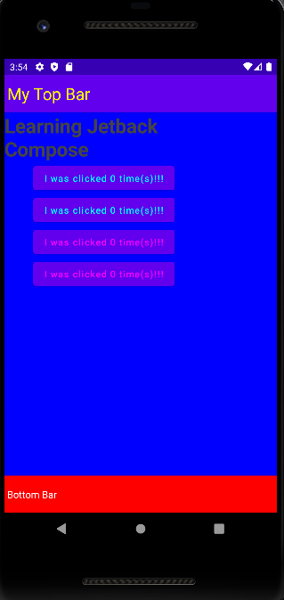

# Learning Jetpack Compose
Sendo o 2º Projeto a utilizar o Jetpack Compose e o 3º em Kotlin e Android Studio, ele conta com uma visão bem mais visível da lógica
Nele (como a primeira imagem e o primeiro vídeo abaixo demonstra), existem 4 botões, sendo que cada par deles é uma espécie de conjunto
Os azuís são botões avulsos, ou seja, ao clicar em um deles, o numerador x (Ex: I was clicked x times(s)!!!) acrescentará um valor uma vez no elemento/botão específico que foi clicado. Assim, se clicar 3 vezes no primeiro e 5 no segundo será impresso "I was clicked 3 times" no primeiro botão azul e "I was clicked 5 times", salientando assim que essas botões foram clicado x vezes
Referente ao vermelho, se você clicar, não importando ser no 1º ou 2º botão, irá acrescentar um valor a mais em ambos, pelos 2 serem interpretados com um conjunto completo. Dessa forma, se clicar 4 vezes em um e 2 no outro botão vermelho, irá aparecer "I was clicked 6 times", insinuando que ambos os botões desse conjunto foram clicado 6 vezes

## Application Compose

<video src="aplicationcompose.mp4" controls title="Video Proj"></video>

## Compose Botão

<video src="composebotao.mp4" controls title="Title"></video>